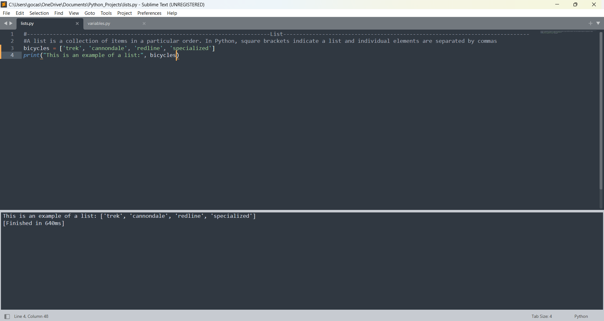

<h1>Python Crash Course</h1>

<h2>Description</h2>
Python is a scripting language used by penetration testers to develop tools and interact with both Windows and Linux environments. Before you can build your own tools, you need to understand the basics of Python and this book does a perfect job of doing just that. You can purchase the most up-to-date copy here: https://nostarch.com/python-crash-course-3rd-edition. 
<br />
<br />
<p align="center">
 <b>Sublime Editor and Python</b> <br />


<h2>Languages and Utilities Used</h2>

- <b>Python</b> 
- <b>Sublime Text Editor</b>

<h2>Environments Used </h2>

- <b>Windows 11</b>


<!--
 ```diff
- text in red
+ text in green
! text in orange
# text in gray
@@ text in purple (and bold)@@
```
--!>
